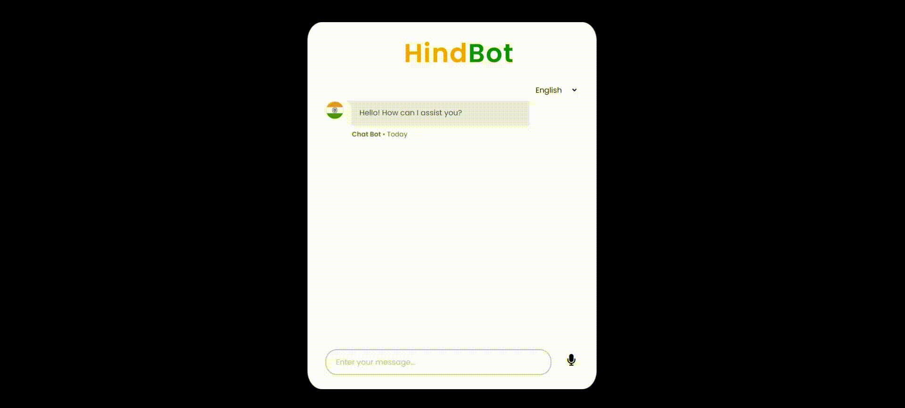

# HindBot


## Chatbot Overview

This chatbot, named HindBot, utilizes Google Palm for its framework and incorporates advanced Retrieval-Augmented Generation (RAG) technology for seamless interactions. It's tailored to process unstructured data from PDFs, sourced through web scraping via Beautiful Soup, primarily from official Indian governmental websites.

## Technical Stack
- **Modular Directory Structure:** Organized codebase for easy maintenance and scalability
- **Google Palm Embeddings:** Convert words to numerical representations for efficient processing
- **Qdrant Vector Database:** Store and manage embeddings for fast querying and retrieval
- **Docker:** Containerize the application for easy deployment and management
- **FastAPI:** Create a robust and interactive web interface with a RESTful API
- **Frontend:** Built using HTML, CSS, JavaScript, and jQuery to provide a seamless user experience

## CI/CD Pipelines
- **GitHub Actions:** Automated CI/CD pipelines for continuous integration and deployment
- Automated testing and validation of code changes
- Automated deployment to AWS Cloud infrastructure

## Cloud Deployment
- **AWS Cloud:** Deployed on Amazon Web Services (AWS) for scalability and reliability
- **EC2 Instance:** Running the chatbot application on a secure and scalable EC2 instance
-** ECR:** Using Amazon Elastic Container Registry (ECR) for container image management

## Key Features
- End-to-end RAG implementation for efficient chatbot responses
- Web scraping using Beautiful Soup for data collection
- Modular directory structure for easy maintenance
- Nomic embeddings for efficient word representation
- Qdrant vector database for fast embedding storage and retrieval
- Docker containerization for easy deployment
- FastAPI-powered web interface for interactive user experience
- Automated CI/CD pipelines using GitHub Actions
- Scalable and secure deployment on AWS Cloud infrastructure

## SInstructions for Execution
### 1. Cloning the Repository
```bash

git clone https://github.com/MANMEET75/HindBot.git
```
### 2. Creating the virtual environment using anaconda
```bash
conda create -p venv python=3.11 -y
```

### 3. Activate the virtual environment
```bash
conda activate venv/
```

### 4. Install the Requirements
```bash
pip install -r requirements.txt
```
### 5. Run the following docker command in your command prompt
```bash
docker-compose up
```
### 6. Generate the Embeddings
```bash
python ingest.py
```
### 7. Run the FastAPI application
```bash
uvicorn app:app --reload --port 8080
```

Enjoy Coding!
